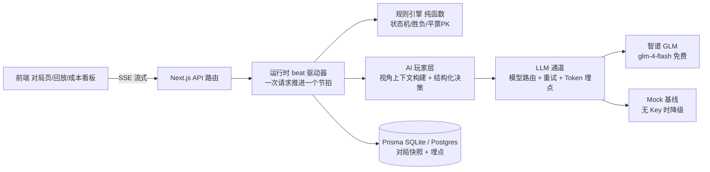

# 🌙 AI 狼人杀（ai-werewolf）

> 你 + 6 个 LLM 玩家的 7 人局狼人杀。AI 玩家各有人设与隐藏身份，会伪装、推理、抱团、带节奏——
> 这是一个用 vibe coding 工作流全程 AI 开发的完整全栈项目。

<!-- 在线 Demo：（部署后填入链接）｜回放示例：（跑一轮 npm run eval 后录制） -->

仓库：https://github.com/Sainny-06/ai-werewolf ｜ 技术栈：Next.js 15 · TypeScript · Prisma · 智谱 GLM · Vitest

## 它是什么

- **完整可玩**：2 狼人 + 1 预言家 + 4 村民的标准局；你随机拿到一个身份（狼人/预言家/村民三种体验），和 6 个 AI 从黑夜打到终局
- **6 个 AI 玩家各有性格**：暴躁老兵铁柱、谨慎大学生小鹿、带节奏主播薇薇、逻辑流程序员老K、热心大妈翠花、话少阴沉的乌鸦——发言风格由 prompt 人设约束
- **信息严格隔离**：狼人只看得到队友、预言家只看得到自己的查验记录——每个 AI 的上下文由独立的视角构建器生成，互不串台
- **真实的 AI 工程细节**：结构化输出校验 + 失败重试 + 规则引擎兜底（游戏永不卡死）、SSE 流式发言、Token 用量埋点、模型路由
- **AI 行为可评测**：`npm run eval` 自动跑 N 局纯 AI 对局，统计好人投票正确率、放逐准确率、狼存活天数等指标（Mock 基线见 [evals/report-mock.md](evals/report-mock.md)，真实模型见 [evals/report-glm.md](evals/report-glm.md)）
- **对局可回放**：每局自动落库，回放页逐条还原，夜间私有信息终局才揭示（不翻牌规则）

## 技术架构



### 几个关键设计决策（也是面试考点）

| 决策 | 做法 | 为什么 |
|---|---|---|
| **规则与 AI 分离** | 状态机、生死、胜负全部是纯函数规则引擎（31 项单元测试）；LLM 只产出"发言/投票/刀口"这些输入，永远不当裁判 | LLM 会算错状态、会被玩家发言带偏；权威状态必须确定性可测 |
| **step 节拍切片** | 前端每调一次 step 接口，服务端只推进一个节拍（一句发言/一次投票/一个夜晚行动） | 适配 serverless 超时；回放天然等于节拍序列；任何 LLM 慢调用都被限制在单个请求内 |
| **信息隔离** | 所有进入 LLM 的上下文必须经过 `buildView(playerId)`，私有信息（队友/查验/刀口）只进对应视角 | 防止 AI "开天眼"；这也是多智能体系统正确性的根基 |
| **输出不可信假设** | 决策类输出 JSON 校验 + 带错误反馈重试（≤3 次）→ 仍失败由规则引擎随机兜底并标记 `fallback` | 游戏任何情况下不能卡死；兜底率本身是评测指标（当前 0） |
| **模型路由** | 发言/遗言用免费 flash 模型，投票/刀口/查验可配置更强模型（`LLM_MODEL_DECIDE`） | 成本与质量分开把控；路由收益用评测数据验证 |
| **Mock 基线** | 无 API Key 时自动降级到策略朴素的 Mock 玩家，评测/冒烟全链路可跑 | 开发不依赖 Key；真实模型的效果提升有对照基线 |

## 快速开始

```bash
npm install
npm run db:push        # 生成 SQLite（prisma/dev.db）
npm run dev            # http://localhost:3000
```

不配置任何 Key 即可运行（Mock 基线模式，AI 行为较朴素）。要接入真实模型：

```bash
# .env.local
ZHIPU_API_KEY=你的智谱APIKey          # https://open.bigmodel.cn
# 可选
LLM_MODEL_SPEECH=glm-4-flash          # 发言模型（免费）
LLM_MODEL_DECIDE=glm-4-flash          # 决策模型（可换 glm-4.6 等更强模型）
DATABASE_URL=...                      # 部署 Postgres 时配置
```

验证命令：

```bash
npm run test     # 规则引擎 31 项单元测试
npm run smoke    # 起服务后运行：HTTP 层端到端自动打一局
npm run eval -- 10   # 跑 10 局纯 AI 对局，产出 evals/report.md
```

## AI 行为评测

仓库附带两组同口径对照数据：

| 指标 | Mock 朴素基线（8 局） | 真实 GLM glm-4-flash（5 局） |
|---|---|---|
| 好人阵营胜率 | 12.5% | 20.0% |
| 好人投票正确率 | 49.1% | 49.5% |
| 放逐准确率 | 12.5% | **40.0%** |
| 狼人平均存活 | 2.0 天 | 1.9 天 |
| 输出兜底率 | 0% | 0% |

（[Mock 报告](evals/report-mock.md) ｜ [GLM 报告](evals/report-glm.md)）

**诚实的观察**：免费 flash 模型的放逐准确率显著优于朴素基线（12.5% → 40%），但单票推理质量仍与随机基线持平（49.5%）——狼人阵营依然强势。这正好构成"模型路由"的下一步实验：把投票/刀口等决策类调用从 glm-4-flash 升级到更强模型（改 `LLM_MODEL_DECIDE` 一个环境变量即可），重跑 `npm run eval` 量化收益。

## 我是如何用 AI 开发的（vibe coding 工作流）

1. **规则先行**：根目录 [AGENTS.md](AGENTS.md) 是给 AI 编程工具的项目宪法（架构铁律/代码风格/禁做事项），每次会话自动遵守；[docs/RULES.md](docs/RULES.md) 先把游戏规则逐条定死，实现照文档来
2. **先方案后代码**：每个模块先让 AI 出实现方案，确认后再写
3. **小步提交**：一个功能一个 commit（见提交历史），面试官可以直接从 log 看到开发路径
4. **看懂再合**：AI 生成的每个文件都要能讲出"为什么这么写"
5. **评测驱动**：不是"能跑就行"——规则引擎 31 项单测覆盖平票 PK/遗言/胜负边界；`npm run eval` 让 AI 玩家行为有量化指标；`npm run smoke` 端到端验证 HTTP 全链路

## 项目结构

```
src/
  app/                  # 页面（/ /game/[id] /replay /stats）与 API 路由
    api/games/          # 创建对局 / 节拍推进(SSE) / 人类操作
  components/           # 游戏视图组件（对局页与回放页共用）
  lib/
    game/               # 规则引擎（纯函数）+ 运行时（beat 驱动）+ 公开状态投影
    agents/             # 人设 / 上下文构建（信息隔离）/ prompt / Mock 玩家
    llm/                # callLLM 统一封装：路由/重试/流式/Token 埋点
  tests/                # Vitest 单元测试
scripts/                # eval.ts 评测 / smoke.ts 冒烟
docs/                   # PRD 与游戏规则（实现依据）
evals/                  # 评测报表
```

## 部署

- **Vercel**：SQLite 需换成 Postgres——`prisma/schema.prisma` 的 datasource 改为 `provider = "postgresql"`，配置 Neon 免费 Postgres 的 `DATABASE_URL`，`npm run db:push` 后部署
- **国内可达（给面试官看的正式链接）**：Zeabur 一键部署，或香港节点轻量服务器（免备案）直接跑 SQLite 版
- 面试官打不开链接 = 前功尽弃，正式演示前务必用手机流量验证一遍

## 路线图（明确没做的）

TTS 配音（edge-tts 免费）、Dify/Coze 工作流版对比、多房间联机、猎人/女巫板子——见 [docs/PRD.md](docs/PRD.md) 的取舍记录。
